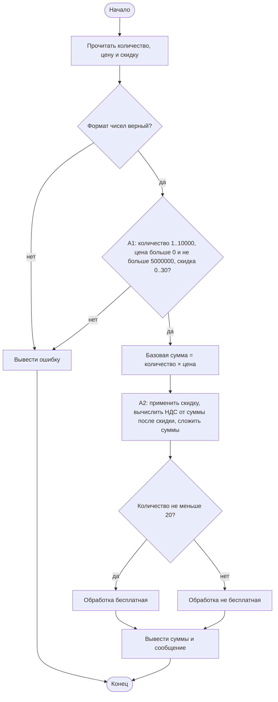

# Activity диаграмма

```mermaid
flowchart TD
    A([Начало]) --> B[Прочитать количество, цену и скидку]
    B --> C{Формат чисел верный?}
    C -- нет --> E[Вывести ошибку] --> Z([Конец])
    C -- да --> D{A1: количество 1..10000, цена больше 0 и не больше 5000000, скидка 0..30?}
    D -- нет --> E
    D -- да --> F[Базовая сумма = количество × цена]
    F --> G[A2: применить скидку, вычислить НДС от суммы после скидки, сложить суммы]
    G --> H{Количество не меньше 20?}
    H -- да --> I[Обработка бесплатная]
    H -- нет --> J[Обработка не бесплатная]
    I --> K[Вывести суммы и сообщение]
    J --> K
    K --> Z
```

