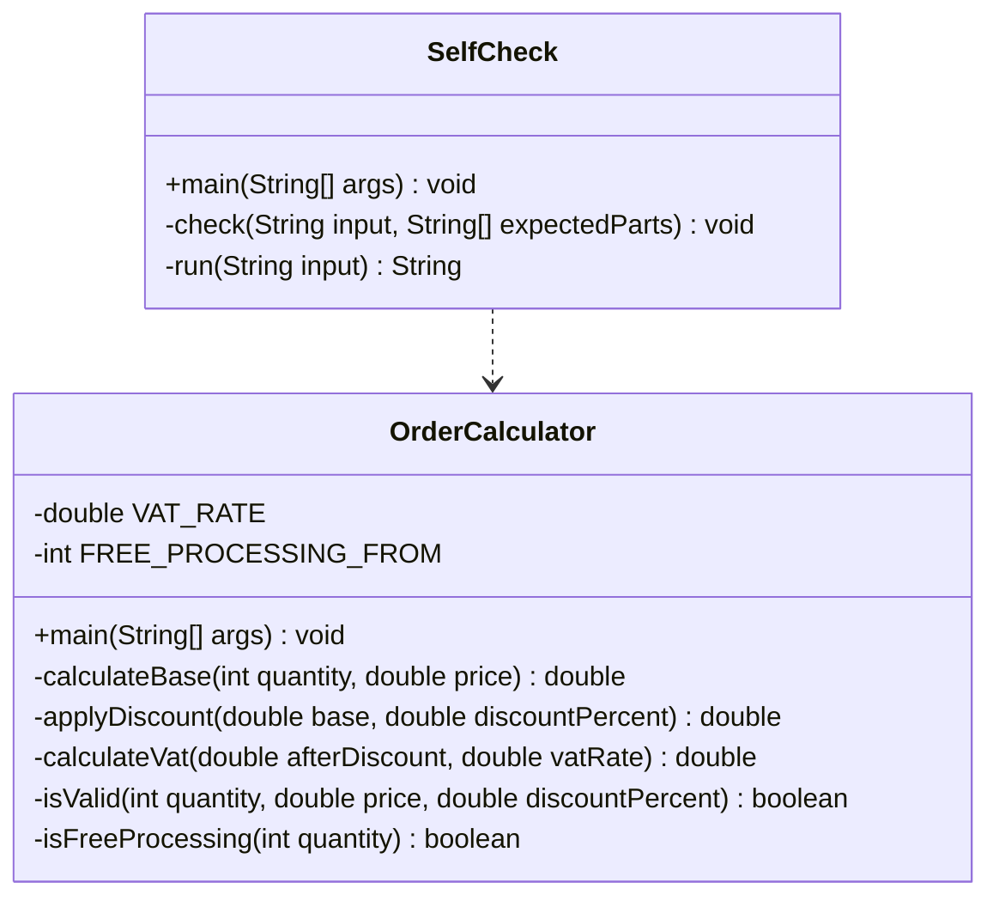

# Диаграмма классов

```mermaid
classDiagram
    class OrderCalculator {
        -double VAT_RATE
        -int FREE_PROCESSING_FROM
        +main(String[] args) void
        -calculateBase(int quantity, double price) double
        -applyDiscount(double base, double discountPercent) double
        -calculateVat(double afterDiscount, double vatRate) double
        -isValid(int quantity, double price, double discountPercent) boolean
        -isFreeProcessing(int quantity) boolean
    }
    class SelfCheck {
        +main(String[] args) void
        -check(String input, String[] expectedParts) void
        -run(String input) String
    }
    SelfCheck ..> OrderCalculator
```

